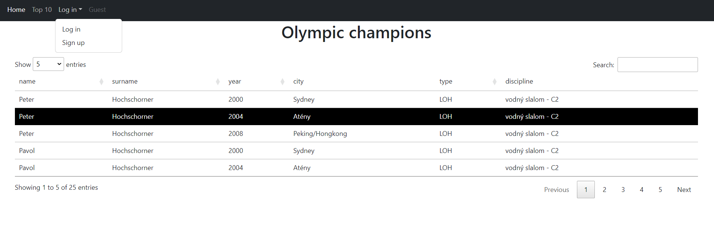

   <body>
    <h1>
        Olimpic champions
    </h1>
    

        

        
The website is fully developed in PHP and provides information about 
athletes' participation in various Olympic games. This information is 
dynamically retrieved from a PostgreSQL database and displayed in the 
form of a table. Users can register as new users on the website or log
in using existing accounts. Google authentication and server-side user authentication 
are used for these purposes. Upon logging in, users gain additional functionality, allowing them
to edit table data, delete entries, and add new data. Each data operation is reflected in the server's database as well.

    

</body>
